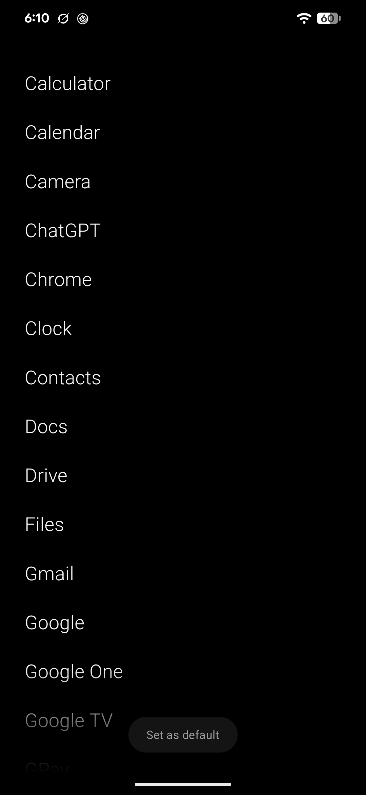
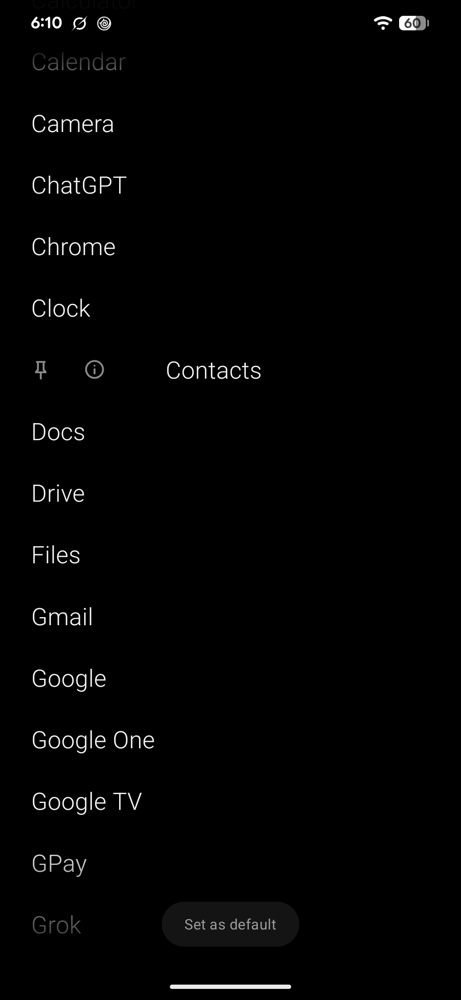

# Intent

A text-only Android launcher. No icons, no widgets, no grid — every app you open should be one.

Built with Expo SDK 57, React Native, and a local Kotlin module.

| Every app, alphabetical | Swipe a row right | Pinned to the top |
| --- | --- | --- |
|  |  |  |

## Download

Grab the latest APK from [Releases](https://github.com/thatbeautifuldream/intent/releases).

## Run on a physical device

Install JDK 21, enable USB debugging, connect the device, and verify that `adb devices` lists it.

```sh
pnpm install
pnpm android --device
```

The Android command creates and installs a development build containing the local Kotlin module. Start Metro for later sessions with:

```sh
pnpm start
```

In the app, select **Set as default** and approve **Intent**. Press the device Home button to return to the launcher. Select any listed app to launch it, or swipe a row right to pin it or open its app info.

Native launcher behavior is contained in `modules/launcher`. Changes to Kotlin or the config plugin require rebuilding the Android app.
